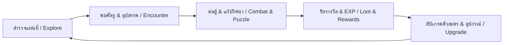

# 🎮 [Game Title / ชื่อเกมของคุณ]

[](https://adoptium.net/)
[](https://libgdx.com/)
[](https://gradle.org/)
[](LICENSE)
[]()

> **[TH]** คำโปรยสั้นๆ เกี่ยวกับเกมของคุณ (เช่น: เกมแนว 2D Action RPG สไตล์พิกเซลอาร์ต ผจญภัยในโลกแฟนตาซี)  
> **[EN]** A short catchy tagline for your game (e.g., An immersive 2D Action RPG pixel-art adventure built with LibGDX).

-----


## 📖 สารบัญ / Table of Contents
- [📌 ภาพรวมของเกม (Game Overview)](#-ภาพรวมของเกม-game-overview)
- [✨ ฟีเจอร์หลัก (Key Features)](#-ฟีเจอร์หลัก-key-features)
- [🔄 วงจรการเล่น (Core Gameplay Loop)](#-วงจรการเล่น-core-gameplay-loop)
- [🎮 การควบคุม (Controls)](#-การควบคุม-controls)
- [🛠️ เทคโนโลยีและโครงสร้างโค้ด (Tech Stack & Architecture)](#️-เทคโนโลยีและโครงสร้างโค้ด-tech-stack--architecture)
- [🚀 วิธีการติดตั้งและรันเกม (Getting Started)](#-วิธีการติดตั้งและรันเกม-getting-started)
- [🗺️ แผนการพัฒนา (Roadmap)](#️-แผนการพัฒนา-roadmap)
- [🎨 เครดิตและลิขสิทธิ์ทรัพยากร (Assets & Credits)](#-เครดิตและลิขสิทธิ์ทรัพยากร-assets--credits)
- [📄 สัญญาอนุญาต (License)](#-สัญญาอนุญาต-license)

---

## 📌 ภาพรวมของเกม (Game Overview)

### [TH] รายละเอียดเกม
* **แนวเกม (Genre):** [ระบุแนวเกม เช่น 2D Action RPG / Roguelike / Platformer / Top-down Shooter]
* **มุมมอง (Perspective):** [ระบุ เช่น Top-down 2D / Side-scrolling / Isometric]
* **ธีม / บรรยากาศ (Theme):** [ระบุ เช่น Dark Fantasy, Sci-Fi, Cyberpunk, Cozy/Farming]
* **กลุ่มเป้าหมาย (Target Audience):** [ระบุ เช่น ผู้เล่นที่ชอบความท้าทาย, ผู้เล่นสายเสพเนื้อเรื่อง]

#### เรื่องย่อ (Story Synopsis)
> ใส่เนื้อเรื่องย่อของเกมที่นี่ เช่น: "ในดินแดนที่ล่มสลาย ผู้เล่นจะได้รับบทเป็นอัศวินฝึกหัดที่ต้องออกเดินทางตามหาเศษเสี้ยวแห่งพลังเพื่อกอบกู้อาณาจักร..."

---

### [EN] Overview
* **Genre:** [e.g., 2D Action RPG / Roguelike / Platformer]
* **Perspective:** [e.g., Top-down 2D / Side-scrolling]
* **Theme:** [e.g., Dark Fantasy / Sci-Fi / Cozy]
* **Target Audience:** [e.g., Casual gamers, Hardcore roguelike enthusiasts]

#### Synopsis
> Provide a brief story synopsis here. (e.g., "In a shattered world, step into the boots of a lone traveler seeking forgotten relics...")

---

## ✨ ฟีเจอร์หลัก (Key Features)

- [ ] **ระบบการต่อสู้ (Combat System):** [เช่น การโจมตี Real-time, ระบบคอมโบ, ระบบแพ้ทางธาตุ]
- [ ] **ระบบตัวละคร & การเติบโต (Progression & Stats):** [เช่น การอัปเลเวล, สายสกิล (Skill Tree), ค่าสเตตัส]
- [ ] **ระบบไอเทมและอุปกรณ์ (Inventory & Equipment):** [เช่น ช่องเก็บของ, การคราฟต์ไอเทม, อาวุธหลากหลายแบบ]
- [ ] **ระบบแผนที่และด่าน (Maps & Exploration):** [สร้างฉากด้วย Tiled Map Editor, มีจุดซ่อนความลับ, ระบบเปลี่ยนฉาก]
- [ ] **ระบบเซฟเกม (Save / Load System):** [บันทึกข้อมูลตำแหน่ง, เควสต์, และช่องเก็บของอัตโนมัติ]
- [ ] **ระบบกราฟิก & เอฟเฟกต์ (Visual Effects & Shaders):** [ใช้งาน `gdx-vfx` สำหรับ Bloom, Vignette, Screen Shake]

---

## 🔄 วงจรการเล่น (Core Gameplay Loop)



---

## 🎮 การควบคุม (Controls)

| การกระทำ (Action) | คีย์บอร์ด & เมาส์ (Keyboard & Mouse) | จอยเกม (Gamepad) |
| :--- | :--- | :--- |
| **เคลื่อนที่ (Move)** | `W` `A` `S` `D` หรือปุ่มลูกศร (Arrow Keys) | `Left Analog Stick` / `D-Pad` |
| **โจมตี / แอ็กชัน (Attack / Action)** | `J` หรือ `คลิกซ้าย (Left Click)` | `X` (Xbox) / `Square` (PS) |
| **ปฏิสัมพันธ์ (Interact / Talk)** | `E` | `A` (Xbox) / `Cross` (PS) |
| **ใช้ไอเทม / หลบ (Dodge / Item)** | `Spacebar` / `Shift` | `B` / `Circle` |
| **เปิดกระเป๋า (Inventory)** | `I` หรือ `Tab` | `Y` / `Triangle` |
| **เมนูตั้งค่า / หยุดเกม (Pause / Options)** | `ESC` หรือ `O` | `Start` / `Options` |

---

## 🛠️ เทคโนโลยีและโครงสร้างโค้ด (Tech Stack & Architecture)

### เครื่องมือที่ใช้ (Technologies & Libraries)
* **Core Engine:** [LibGDX 1.14.2](https://libgdx.com/)
* **Language:** Java 21
* **Backend:** LWJGL3 Desktop Backend
* **Post-Processing / Shaders:** `gdx-vfx` (0.5.4)
* **Map Editor:** [Tiled Map Editor](https://www.mapeditor.org/)
* **Sprite & Animation:** [Aseprite](https://www.aseprite.org/)
* **Build Tool:** Gradle with Kotlin DSL (`build.gradle.kts`)
* **Testing:** JUnit 5, Mockito, AssertJ

### โครงสร้างโปรเจกต์ (Project Directory Structure)
```text
GdxGame/
├── core/                       # โค้ดหลักของเกม (Logic, Screens, Entities, Systems)
│   ├── src/main/java/          # Java source code
│   │   └── com/gdx/game/
│   │       ├── entities/       # Player, Enemies, NPCs
│   │       ├── screens/        # MenuScreen, GameScreen, OptionScreen, BattleScreen
│   │       ├── systems/        # Combat, Inventory, Physics/Collision
│   │       └── GdxGame.java    # Game entry point / lifecycle manager
│   └── src/main/resources/     # Assets (Sprites, Maps, Audio, Fonts)
├── desktop/                    # Launcher สำหรับ Desktop (Windows/macOS/Linux)
│   └── src/main/java/          # DesktopLauncher.java (Display configs, LWJGL3)
├── gradle/                     # Version catalogs (libs.versions.toml) & wrappers
├── build.gradle.kts            # Root Gradle configuration
├── gradlew / gradlew.bat       # Gradle wrapper executable
└── README.md                   # คู่มือและเอกสารโปรเจกต์
```

---

## 🚀 วิธีการติดตั้งและรันเกม (Getting Started)

### ความต้องการของระบบ (Prerequisites)
* **Java Development Kit (JDK):** Version 21 หรือสูงกว่า (แนะนำ Eclipse Temurin / OpenJDK 21)
* **Git:** สำหรับโคลนโค้ด

### 1. โคลนคลังโค้ด (Clone Repository)
```bash
git clone https://github.com/[your-username]/[your-repo].git
cd [your-repo]
```

### 2. รันเกมบน Desktop (Run Game)
* **Windows (Command Prompt / PowerShell):**
  ```powershell
  .\gradlew.bat desktop:run
  ```
* **macOS / Linux:**
  ```bash
  ./gradlew desktop:run
  ```

### 3. รันการทดสอบ (Run Tests)
```bash
# Unit Tests
./gradlew unitTest

# Integration Tests
./gradlew integrationTest
```

### 4. รวมไฟล์เป็น Executable Fat JAR (Build Distribution)
```bash
./gradlew desktop:fatJar
```
ไฟล์ JAR ที่รวม dependencies ทั้งหมดจะถูกสร้างขึ้นที่:
`desktop/build/libs/GdxGame-all-2.6.1.jar`  
สามารถนำไปรันบนเครื่องอื่นได้ทันทีด้วยคำสั่ง:
```bash
java -jar desktop/build/libs/GdxGame-all-2.6.1.jar
```

---

## 🗺️ แผนการพัฒนา (Roadmap)

### 🚩 Phase 1: Prototype (โครงสร้างพื้นฐาน)
- [x] ติดตั้งและเซ็ตอัป LibGDX + Gradle Kotlin DSL
- [x] โหลดแผนที่ Tiled Map (`.tmx`) และเรนเดอร์ลงจอ
- [x] ระบบการเคลื่อนที่และการอนิเมชันของตัวละครหลัก (Player Controller)
- [ ] ระบบการชนขอบฉากและวัตถุ (Collision Detection)

### 🚩 Phase 2: Core Gameplay (ระบบหลัก)
- [ ] ระบบศัตรูและ AI การเดินตรวจตรา (Enemy AI & Pathfinding)
- [ ] ระบบการโจมตีและการคำนวณ Damage / Health Bar
- [ ] ระบบช่องเก็บของ (Inventory) และไอเทมดรอป
- [ ] ระบบเควสต์และบทสนทนา (Dialogue & Quest System)

### 🚩 Phase 3: Polish & Effects (การขัดเกลาและเอฟเฟกต์)
- [ ] ปรับปรุง Visual Effects (Screen Shake, Bloom, Lighting) ด้วย `gdx-vfx`
- [ ] ใส่เสียงประกอบ (Sound Effects) และเพลงประกอบ (BGM)
- [ ] เมนูหน้าแรก (Main Menu), หน้าตั้งค่า (Settings), หน้ารวมเครดิต (Credits)
- [ ] รองรับการควบคุมด้วย Gamepad / Controller

### 🚩 Phase 4: Release & Distribution (การเผยแพร่)
- [ ] ทดสอบประสิทธิภาพและแก้บั๊ก (Optimization & Bug Fixing)
- [ ] Export Executable สำหรับ Windows (`.exe` / JAR), macOS, Linux
- [ ] เผยแพร่ Demo บน Itch.io / Steam

---

## 🎨 เครดิตและลิขสิทธิ์ทรัพยากร (Assets & Credits)

| ประเภท (Type) | ทรัพยากร / รายละเอียด (Resource) | ผู้สร้าง / แหล่งที่มา (Author / Source) | ลิขสิทธิ์ (License) |
| :--- | :--- | :--- | :--- |
| **Sprites / Art** | [Mana Seed Farmer Sprite / Pixel Art] | [Seliel the Shaper] | CC-BY / Free Sample |
| **Tilesets** | [Custom / Tiled Assets] | [ชื่อผู้สร้าง] | [License] |
| **Music / BGM** | [ชื่อเพลงประกอบ] | [ชื่อผู้ประพันธ์] | [License] |
| **SFX** | [Sound Effects Pack] | [ชื่อผู้สร้าง] | [License] |
| **Fonts** | [Pixel Font] | [ชื่อผู้สร้าง] | [License] |

---

## 📄 สัญญาอนุญาต (License)

โปรเจกต์นี้เผยแพร่ภายใต้สัญญาอนุญาต **[MIT License](LICENSE)** (หรือระบุสัญญาอนุญาตที่คุณต้องการ)  
(ดูรายละเอียดเพิ่มเติมได้ที่ไฟล์ [LICENSE](file:///D:/GdxGame/LICENSE))

---

## 👨‍💻 ผู้พัฒนาและการติดต่อ (Authors & Contact)
* **ผู้พัฒนา (Developer):** [ใส่ชื่อหรือนามแฝงของคุณ]
* **GitHub:** [@your-github-handle](https://github.com/)
* **Email / Contact:** [your-email@example.com]
